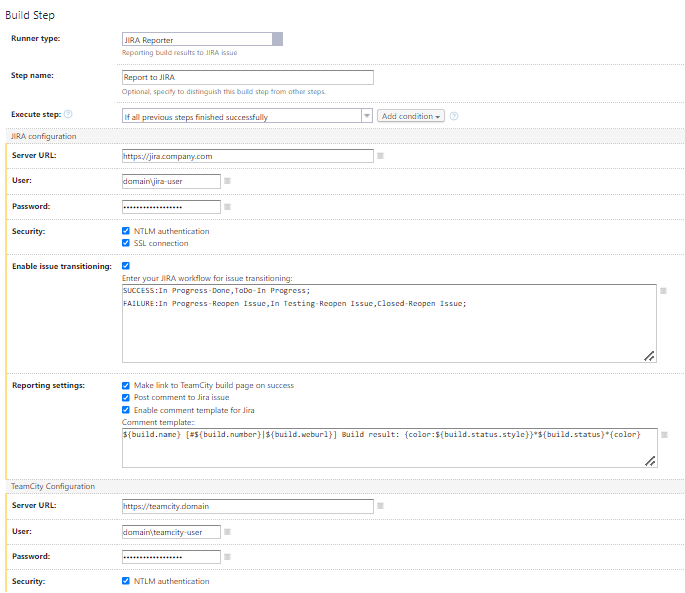

Plug-in is designed for sending build results from TeamCity in JIRA ticket and it is also possible to move the issue through your workflow. Report are sent as comments to the issue.

[Download plugin](https://github.com/mkiszka/jirareporter/releases)
[Source code](https://github.com/mkiszka/jirareporter)

## The advantages

* Sending TeamCity build results from any VCS branch;
* Moving the issues through workflow, depending on the results of TeamCity builds;
* Sending report of TeamCity build on several issues at the same time.

## Settings

1. Install plug-in in [ < TeamCity Data Directory >/plugins](http://confluence.jetbrains.com/display/TCD7/TeamCity+Data+Directory) and restart TeamCity server;
2. Add Build Step JIRA Reporter to your configuration. 
   **
Important!** In order to create an account Build Step must be the last step in hierarchy;

3. Plug-in parameters:



~~**Get issue from:**~~

~~Field, determining the method of getting id issue:~~

~~_JIRA Reporter_ - connected id of the issue is indicated in the plug-in settings;~~

~~_VCS Comment_ - issue id is taken from vcs commit,~~ 

~~Identifiers are collected from the related issues of all builds until the last successful one. To do this, you need to configure TeamCity integration with your task tracker (Administration -> Problem Tracking -> Create a new connection).~~

~~Example:~~

```
git commit -m "fix for EXAMPLE-123"
```

**Enable issue transition:**

Movement of the issue through the workflow turns on depending on test results;

**Enter your JIRA workflow for issue transitioning:**

Appears when turning on Enable issue transitioning;


Field to insert the requirements for issue movement through workflow.

If you need to set the resolution after the transition, the resolution name can be defined as Resolution[\<resolution name\>] as the third parameter of the transition rule

Format for inserting requirements: 

```
SUCCESS:In Progress-Resolve Issue-Resolution[Fixed],Closed-Deploy,In Testing-Close Issue;
FAILURE:In Progress-Reopen Issue,In Testing-Reopen Issue,Closed-Reopen Issue;
```

**Enable SSL connection:**

Needs to be turned on if JIRA server uses SSL connection.

## Example of JIRA result output:


## Template for JIRA comment

Activate checkbox for editing template, and write yourself template of JIRA comment.

Also you have defined parameters:
```
${build.id}
${build.type}
${build.name}
${build.number}
${build.status}
${build.status.style}
${build.weburl}
${tests.results}
```

Example:
```
${build.type.name} : ${status.build}
${test.results}
Template example.
```
